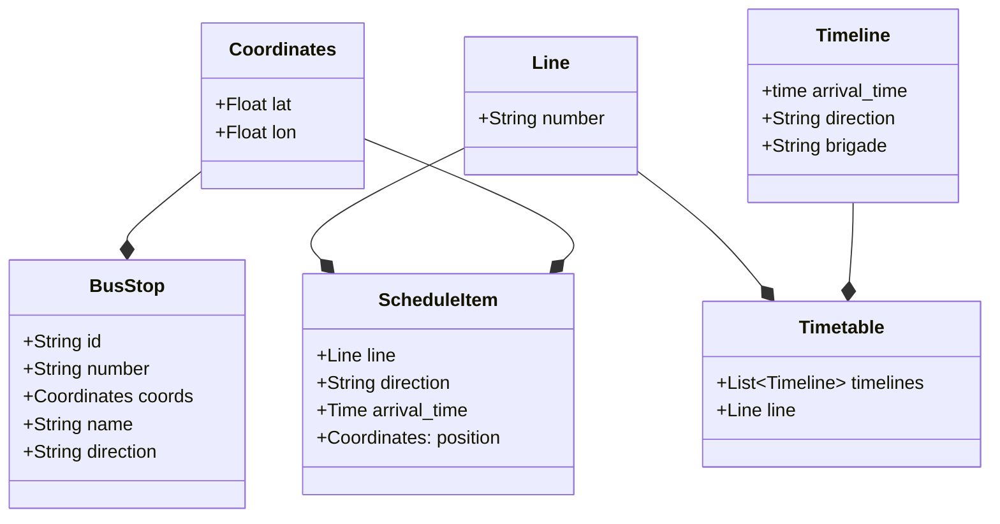

# Domain classes reference

```mermaid
classDiagram
    class Coordinates {
        +Float lat
        +Float lon
    }

    class BusStop {
        +String id
        +String number
        +Coordinates coords
        +String name
        +String direction
    }

    class Line {
        +String number
    }

    class Timeline {
        +time arrival_time
        +String direction
        +String brigade
    }

    class Timetable {
        +List~Timeline~ timelines
        +Line line
    }

    class ScheduleItem {
        +Line line
        +String direction
        +Time arrival_time
        +Coordinates: position
    }

    Coordinates --* BusStop
    Line --* Timetable
    Timeline --* Timetable
    Line --* ScheduleItem
    Coordinates --* ScheduleItem

```